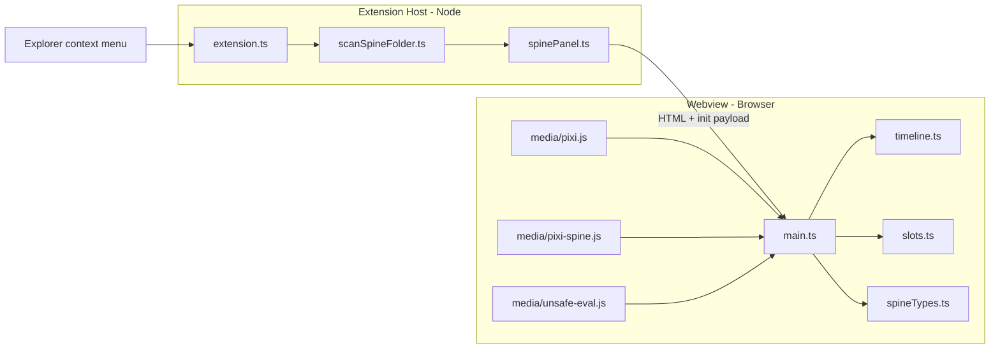
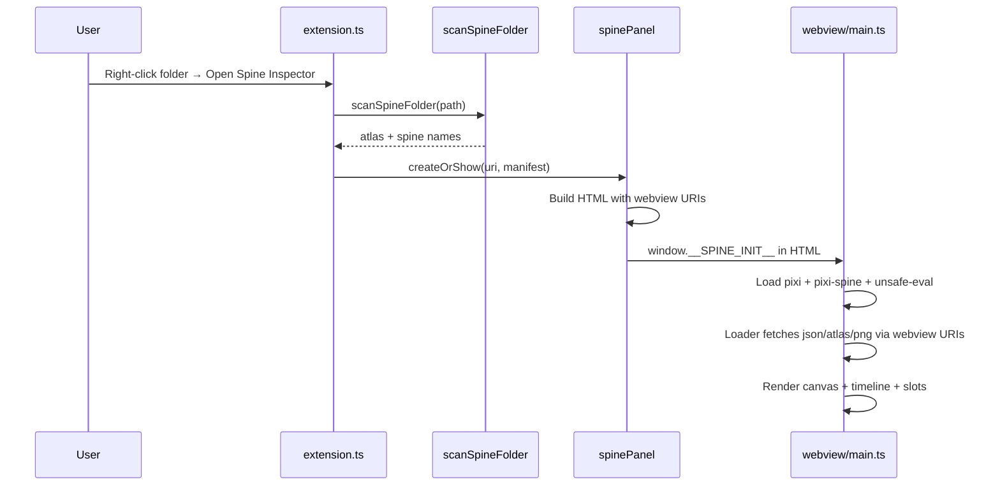
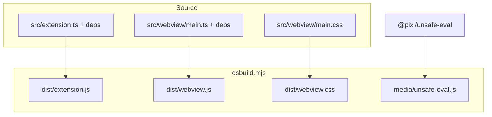

<div align="center">
  
  <h1>Spine Inspector</h1>
</div>

A VS Code / Cursor extension that previews **Spine 3.8** skeletons and animations directly in the editor. Right-click any folder containing Spine export files to open an interactive viewer with multi-track playback, timeline scrubbing, event markers, and slot debugging.


## Features

- Open any workspace folder that contains Spine assets (`.atlas` + `.json`)
- Preview skeletons on a Pixi canvas inside a webview tab
- **Multi-track timeline** — play several animations at once on different tracks
- **Play / Stop toggle** per track, with scrubbing while paused
- **Event markers** on the timeline (hover to see event names)
- **Slots panel** — click a slot to show a red marker on the skeleton
- Loop, reset, add/delete tracks, stop all

## Requirements

| Requirement | Version |
|-------------|---------|
| VS Code / Cursor | `^1.85.0` |
| Node.js | 18+ recommended |
| Spine export format | **3.8.x** only |

### Asset layout

Each folder you open must contain:

```
mySpineFolder/
  popups.atlas          # one atlas file
  popupWin.json         # one or more skeleton JSON files
  bonusGame.json
  popups.png            # texture pages referenced by the atlas
  popups2.png
```

The extension scans **only the folder you right-clicked** (no subfolder recursion).

---

## Architecture

### High-level flow



### Module responsibilities

| Module | Runs in | Role |
|--------|---------|------|
| [`src/extension.ts`](src/extension.ts) | Extension host | Registers the `spine-inspector.open` command and Explorer context menu |
| [`src/scanSpineFolder.ts`](src/scanSpineFolder.ts) | Extension host | Scans a folder for one `.atlas` and one or more `.json` files (replaces PHP manifest logic) |
| [`src/spinePanel.ts`](src/spinePanel.ts) | Extension host | Creates the `WebviewPanel`, CSP-safe HTML, and `asWebviewUri` asset URLs |
| [`src/webview/main.ts`](src/webview/main.ts) | Webview | Boots Pixi, loads spines, wires sidebar + timeline + slots |
| [`src/webview/timeline.ts`](src/webview/timeline.ts) | Webview | Track rows, play/stop toggle, scrubbing, event markers |
| [`src/webview/slots.ts`](src/webview/slots.ts) | Webview | Slot list and red bone markers on the canvas |
| [`src/webview/spineTypes.ts`](src/webview/spineTypes.ts) | Webview | Shared types and Spine helpers (`applyPose`, `animationEvents`, etc.) |
| [`media/pixi.js`](media/pixi.js) | Webview | PixiJS 6.2.2 (vendored) |
| [`media/pixi-spine.js`](media/pixi-spine.js) | Webview | pixi-spine runtime for Spine 3.8 |
| [`media/unsafe-eval.js`](media/unsafe-eval.js) | Webview | CSP-safe Pixi polyfill (copied on compile from `@pixi/unsafe-eval`) |

### Data flow when opening a folder



### Build pipeline



---

## Project structure

```
spine-inspector/
├── src/
│   ├── extension.ts          # Entry point (extension host)
│   ├── scanSpineFolder.ts    # Folder scanner
│   ├── spinePanel.ts         # Webview panel + HTML
│   └── webview/
│       ├── main.ts             # Webview entry
│       ├── main.css            # UI styles
│       ├── timeline.ts         # Multi-track timeline
│       ├── slots.ts            # Slot markers
│       └── spineTypes.ts       # Shared types/helpers
├── media/
│   ├── pixi.js                 # Vendored Pixi (committed)
│   ├── pixi-spine.js           # Vendored pixi-spine (committed)
│   └── unsafe-eval.js          # Generated on compile (gitignored)
├── dist/                       # Build output (gitignored)
├── imgs/                       # Extension assets
├── esbuild.mjs                 # Build script
├── package.json
├── tsconfig.json
└── .vscode/
    └── launch.json             # F5 debug configuration
```

---

## Getting started

### Install dependencies

```bash
npm install --legacy-peer-deps
```

`--legacy-peer-deps` is required because `@pixi/unsafe-eval@6.2.2` pins a peer dependency on matching Pixi packages.

### Compile

```bash
npm run compile
```

This produces:

- `dist/extension.js` — extension host bundle
- `dist/webview.js` — webview bundle
- `dist/webview.css` — copied from `src/webview/main.css`
- `media/unsafe-eval.js` — copied from `node_modules`

### Watch mode (development)

```bash
npm run watch
```

Rebuilds automatically when TypeScript sources change. Reload the Extension Development Host window after changes to `extension.ts`; webview changes often need closing and reopening the Spine Inspector tab.

---

## Run locally

1. Open this folder in VS Code or Cursor.
2. Run **Compile** (`npm run compile`) if you have not already.
3. Press **F5** (or **Run and Debug** → **Run Extension**).
4. In the **Extension Development Host** window, open a workspace with Spine assets.
5. Right-click a folder containing `.atlas` + `.json` files → **Open Spine Inspector**.

### Install permanently (VSIX)

```bash
npm install -g @vscode/vsce
npm run compile
vsce package
```

Then in VS Code / Cursor: **Extensions** → **⋯** → **Install from VSIX** → select `spine-inspector-0.1.0.vsix`.

---

## Usage

### Open the viewer

- **Explorer** → right-click a folder with Spine files → **Open Spine Inspector**

The folder must have at least one `.atlas` file and one `.json` skeleton file.

### Timeline controls (per track)

| Control | Action |
|---------|--------|
| Animation dropdown | Choose skeleton animation |
| Loop | Loop on/off for that track |
| Play / Stop | Toggle playback (resumes from playhead; restarts from 0 only if animation ended) |
| Reset | Jump playhead to start |
| Delete | Remove track (minimum one track remains) |
| Timeline bar | Click or drag to scrub while paused |
| Orange dots | Spine events (hover for name) |

### Slots

- Click a slot name in the sidebar to show a **red marker** on the skeleton.
- Click again to hide it.

---

## Development

### Prerequisites

- Node.js 18+
- VS Code or Cursor `^1.85.0`

### Typical workflow

1. Clone the repository.
2. `npm install --legacy-peer-deps`
3. `npm run watch` in a terminal.
4. Press **F5** to launch the Extension Development Host.
5. Edit code:
   - **Host code** (`src/extension.ts`, `scanSpineFolder.ts`, `spinePanel.ts`) → reload Extension Development Host (`Ctrl+R` / `Cmd+R`).
   - **Webview code** (`src/webview/*`) → close and reopen the Spine Inspector tab, or reload the window.

### Debugging

| Target | How |
|--------|-----|
| Extension host | F5 → set breakpoints in `src/extension.ts`, `spinePanel.ts`, etc. |
| Webview | In Extension Development Host: **Help** → **Toggle Developer Tools** → Console / Sources |

### Code conventions

- Extension host code lives in `src/` (Node, `vscode` API).
- Webview code lives in `src/webview/` (browser, no `vscode` except `acquireVsCodeApi`).
- Keep webview logic split: `main.ts` orchestrates, `timeline.ts` / `slots.ts` own UI features.
- Do not import Pixi via npm in the webview; use vendored `media/pixi.js` and `media/pixi-spine.js` (CSP + version lock).

### Common issues

| Problem | Fix |
|---------|-----|
| `unsafe-eval` error in webview | Run `npm run compile` so `media/unsafe-eval.js` is copied |
| Blank webview | Recompile, reload F5; check DevTools console |
| Textures missing | Place PNG files next to the `.atlas` in the same folder |
| Wrong Spine version | Export skeletons as **Spine 3.8.x** |

---

## Contributing

### Branch workflow

```bash
git checkout -b feature/my-change
# ... edit, compile, test ...
git add .
git commit -m "feat: short description of why"
git push -u origin feature/my-change
```

### Pull requests

1. Fork the repository (if external contributor) or create a branch on the main repo.
2. Keep PRs **focused** — one feature or fix per PR.
3. Before opening a PR:
   - `npm run compile` succeeds with no errors
   - Test with **F5** on a real Spine folder
   - Do not commit `node_modules/`, `dist/`, or `*.vsix` (see [`.gitignore`](.gitignore))
4. Open a pull request with:
   - **What** changed
   - **Why** it was needed
   - **Test plan** (steps you ran in the Extension Development Host)

### PR checklist

- [ ] `npm run compile` passes
- [ ] Tested via F5 with Spine 3.8 assets
- [ ] No unrelated files in the diff
- [ ] Webview changes verified in DevTools if UI-related

---

## Scripts reference

| Script | Command | Description |
|--------|---------|-------------|
| Compile | `npm run compile` | One-off build |
| Watch | `npm run watch` | Rebuild on file changes |
| Prepublish | `npm run vscode:prepublish` | Runs before `vsce package` / marketplace publish |

---

## License

See repository license. PixiJS and pixi-spine are used under their respective licenses (see vendored files in `media/`).
